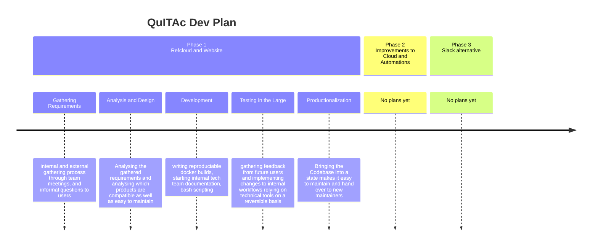
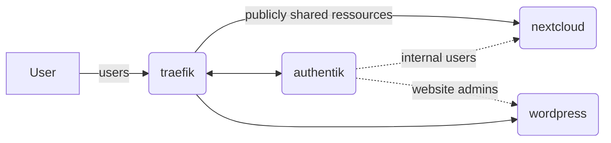

# server-setup

This repository contains dotfiles and other important scripts to quickly provision a new server.

## Plans

QuITAc decided to structure the development of the Queerreferats digital resources.
The following graph shows the subphases or steps per phase



We are currently in phase 1, sub-phase 3 (development).
In subphase 1 we have gathered the following feedback externally and internally:
* SSO solution
* new Website with user-friendly backend
* Cloud inclunding Groupware
* Data security and privacy
* Extensibility

This can be translated to the following technical requiments
* FOSS where possible
* Reproducability and automation where possible
* good documentation
* Multistage backups
* build with extending the feature set in future in mind
* using well-maintained products

This has led us to the follwing design decisions in subphase 2:
* Hosting on. Hetzner
	* well-liked
	* works with docker even behind virtualization
	* fair prizes
	* need data addendum to our data agreemtents with users (negative, but managable)
* Cloud based on Nextcloud
	* Easy to integate/ ready-made groupware and add-ons
	* supports common sso standards
	* self-hostable
* SSO by Authentik
	* integrates well with nextcloud
	* new, stylish and covers a lot of technical cases
	* user-friendly interface included, but also scriptable/configurable through cli
* Traefik Reverse Proxy
	* ingenious integration into docker
	* well-maintained, well-liked
	* secure
	* integrates well with authentik as path authenticator
* Wordpress for Website
	* old-ish design, php-based (negative point)
	* best supported FOSS CMS
	* easy to use user-wise
	* good extensive documentation
	* plethora of themes, workable for us to translate external themes (ivana)

We can therefore project the following base architecture on hetzner servers:



## Steps

### Setup

As root run

```bash
apt update && apt upgrade -y
xargs -d '\n' -n 1 -- apt-get install -y < packages.txt
```

and don't forget to change the root password from the default!

next, create a user without sudoer access (ofc with a good password) and call it `quitac`! Please inform the rest of the team of the new credentials.

```bash
useradd -m quitac
passwd quitac
```

### Docker

Install docker headless with as per [Debian Install Manual](https://docs.docker.com/engine/install/debian/)

Install the rootless setup with

```bash
sudo apt-get install -y docker-ce-rootless-extras
```

switch to the new useraccount with `ssh quitac@localhost`. this is importand as some systemd commands only work this way!

Now, run

``` bash
dockerd-rootless-setuptool.sh install
```

and enter the export entries that the script provied into the `.bashrc` of the user. Further follow the [rootless guide](https://docs.docker.com/engine/security/rootless/) under `Usage` for systemd. REmeber that you cannot run as sudo, so replace `$(whoami)` with quitac and switch back to the root user for sudo results.

### Exposing privileged ports

iptables needs to map the privileged ports to unprivileged ones.

```bash
iptables -t nat -I OUTPUT -p tcp -d 127.0.0.1 --dport 80 -j REDIRECT --to-ports 1080
iptables -t nat -I PREROUTING -p tcp --dport 80 -j REDIRECT --to-ports 1080
iptables -t nat -I OUTPUT -p tcp -d 127.0.0.1 --dport 443 -j REDIRECT --to-ports 1443
iptables -t nat -I PREROUTING -p tcp --dport 443 -j REDIRECT --to-ports 1443

iptables-save > /etc/sysconfig/iptables
```

or follow [this guide](https://docs.docker.com/engine/security/rootless/#exposing-privileged-ports)
